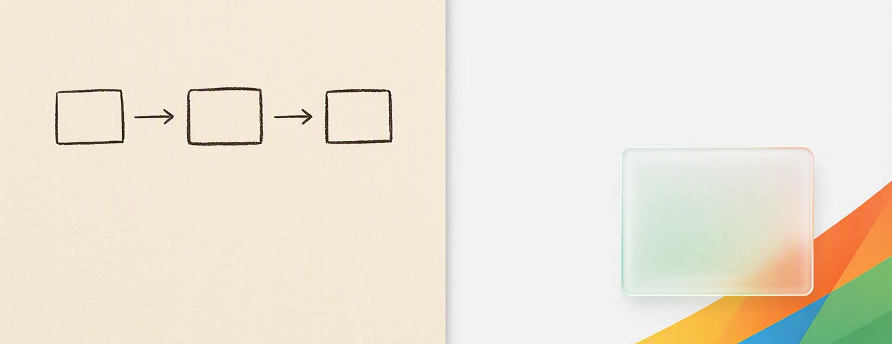

# Slidev Skill (extended)

An [Agent Skill](https://code.claude.com/docs/en/skills) that teaches AI coding
agents how to build [Slidev](https://sli.dev) presentations — syntax, layouts,
animations, code features, exporting, and the visual-design decisions that make
a deck look deliberate instead of default.

This is a **superset of the official
[`slidevjs/slidev`](https://github.com/slidevjs/slidev/tree/main/skills/slidev)
skill**: full parity with all 53 upstream references, plus 9 additions covering
custom diagram authoring, presentation styling, and gotchas that cost hours the
first time you hit them.

Works with GitHub Copilot CLI, Claude Code, and any runtime that supports the
Agent Skills spec.

---

## Install

Clone into your agent's skills directory:

```bash
# GitHub Copilot CLI
git clone https://github.com/diegomejiaio/slidev-skill-msft.git ~/.copilot/skills/slidev

# Claude Code
git clone https://github.com/diegomejiaio/slidev-skill-msft.git ~/.claude/skills/slidev
```

Update later with `git -C <path> pull`.

The agent loads it automatically when a request involves Slidev. To confirm it's
picked up, ask your agent to list its available skills.

---

## What this adds over the official skill

The upstream skill documents Slidev's feature surface. These additions cover the
part that isn't in the docs — how to actually make a deck *look* like something.

| Reference | What it covers |
|---|---|
| `diagram-rough-sketch` | Hand-drawn architecture diagrams with **rough.js** — a copyable base Vue component, click staging, resize-safe redraw, and the pitfalls (Slidev's `transform: scale()` corrupting DOM measurements, seeded randomness so shapes don't jump on resize) |
| `animation-svg-anime` | Storytelling SVG diagrams driven by **anime.js v4** — sequence reveals, n-tier architecture, packet flows, plus the non-obvious failure modes around wrapping, `getTotalLength()`, and reverse navigation |
| `style-microsoft-modern` | A complete light theme in the Microsoft "Modern"/Fluent design language: animated brand swoosh, paper grain, glass cards, and Selawik typography that renders identically across macOS, Windows, and Linux |
| `style-microsoft-icons` | Fluent UI System Icons, Azure Architecture Icons, and brand marks — each with its integration path and **its licensing constraints stated up front** |
| `diagram-excalidraw` | Rendering `.excalidraw` drafts as SVG inside a slide via the community addon |
| `build-pwa` | Opt-in service worker precaching every built asset, so a deck runs fully offline — including the gotchas and a pre-flight checklist to verify *before* you're on stage |
| `presenter-laser-pointer` | Native laser pointer cursor for emphasis during a talk |
| `tool-studio` | The visual, Keynote-style editor that only ever writes small Markdown diffs |
| `troubleshooting` | Quirks that aren't bugs but surprise everyone once: goto dialog stuck visible, `v-click` focus rings, self-hosted font load failures, `layout: center` clipping, HMR missing config changes, misleading Playwright screenshots |

### Opinionated guidance

Beyond adding references, `SKILL.md` **weights** them. The upstream tables list
Mermaid and PlantUML alongside everything else, which nudges agents toward
auto-layout diagrams that then fight you on spacing, theming, and reveal order.

Here, hand-authored SVG/Vue is the documented default for any diagram that
carries the argument of the talk. Mermaid and PlantUML are scoped to what
they're genuinely good at: structural diagrams generated from real structure
(state machines, ER models, exact sequences) and throwaway sketches.

---

## Usage

Once installed, just describe what you want:

```
Create a Slidev deck about TypeScript generics with runnable code examples
```

```
Add a hand-drawn architecture diagram that builds up one click at a time
```

```
Style this deck with the Microsoft Modern theme and add a disclaimer slide
```

```
Configure this deck to work offline and export it to PDF with speaker notes
```

### Let the agent edit slides through MCP

Slidev ships a built-in MCP server. With the dev server running, point your
agent at it:

```bash
claude mcp add --transport http slidev http://localhost:3030/__mcp
```

The agent then edits slides through structured tools instead of patching
Markdown blind — and `slidev-goto-slide` navigates your live browser so it can
verify the result visually. See `references/tool-mcp.md`.

---

## Repository layout

```
SKILL.md              # entry point — quick start, weighted reference index
references/           # 62 focused references, one topic each
  core-*.md           #   syntax, layouts, components, CLI, frontmatter
  syntax-*.md         #   block frontmatter, Comark, imports, merging
  code-*.md           #   highlighting, magic-move, Monaco, Twoslash
  animation-*.md      #   clicks, motion, rough markers, anime.js SVG
  diagram-*.md        #   rough.js, Excalidraw, LaTeX, Mermaid, PlantUML
  layout-*.md         #   slots, draggable, zoom, global layers, canvas size
  style-*.md          #   icons, scoped styles, Microsoft Modern
  build-*.md          #   PDF, hosting, PWA, SEO, OG images
  presenter-*.md      #   notes, timer, recording, remote, laser pointer
  editor-*.md         #   VS Code, Monaco, Prettier, side editor
  tool-*.md           #   MCP server, Studio, theme ejection
  api-slide-hooks.md  #   lifecycle hooks
  troubleshooting.md
docs/banner.png
```

References are deliberately small and single-topic so an agent loads only what
the current task needs.

---

## Contributing

Issues and PRs welcome. Two conventions worth knowing:

- **One topic per reference file**, with `name` and `description` frontmatter.
  Agents select references by description, so make it specific.
- **Document the failure mode, not just the happy path.** The most valuable
  parts of this skill are the pitfalls sections — they're what an agent can't
  infer from the official docs.

When adding a reference, add its row to the matching table in `SKILL.md`.

---

## Credits and license

MIT — see [`LICENSE`](LICENSE).

Built on the official Slidev skill by
[Anthony Fu](https://github.com/antfu) and the
[Slidev](https://github.com/slidevjs/slidev) contributors (MIT). The rough.js
patterns are adapted from
[`bronto-community/ai-sre-talk`](https://github.com/bronto-community/ai-sre-talk)
by Severin Neumann (MIT).

Full attributions, including the licensing terms of fonts and icon sets that
this skill *references but does not redistribute*, are in
[`NOTICE.md`](NOTICE.md).

### Trademarks

Microsoft, Azure, Fluent, and Segoe are trademarks of the Microsoft group of
companies. **This project is independent and community-maintained. It is not
affiliated with, endorsed by, or sponsored by Microsoft.**

The "Microsoft Modern" references describe how to build decks in a Fluent-like
visual language using publicly available, openly licensed assets. Your use of
Microsoft trademarks and brand assets in decks you produce is subject to
Microsoft's
[Trademark and Brand Guidelines](https://www.microsoft.com/legal/intellectualproperty/trademarks),
and remains your responsibility.

---

## Links

- [Slidev documentation](https://sli.dev)
- [Slidev features](https://sli.dev/features/)
- [Theme gallery](https://sli.dev/resources/theme-gallery)
- [Showcases](https://sli.dev/resources/showcases)
